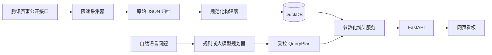

# KPL Data Lab

一个本地优先、可开源复现的王者荣耀 KPL 历史对局分析项目。它把公开赛事接口中的联赛、比赛、小局、BP、选手、英雄、装备和铭文数据归档到本地，再通过 DuckDB、FastAPI 和网页看板提供统计查询。

> 当前是可运行的 MVP。第一次启动会生成明确标记的演示数据；真实赛事数据需要主动执行回填命令。仓库不提交抓取后的比赛数据。

## 已实现

- 按近 N 天增量归档公开联赛、比赛、小局和局详情 JSON；支持断点跳过及强制刷新。
- 英雄选取率、禁用率、BP 率、胜率、KDA、月度趋势、分路和第几个 Pick 分布。
- 支持分路优先的英雄搜索、赛事范围选择，以及俱乐部与选手搜索。
- 同位置对位、同队搭档、单件装备出现率、完整 150 级铭文页和 2/3 英雄组合统计。
- 同时展示全局第 1–10 个 Pick 与己方第 1–5 个 Pick 的选取顺位。
- 选手胜率、KDA、MVP、英雄池和月度趋势。
- 自然语言查询：规则规划器开箱即用；也可接入兼容 Chat Completions JSON 输出的模型 API。
- 受控查询 DSL：模型只选择已经实现的统计动作，不能直接执行 SQL。
- 网页数据管理：点击执行近 N 天回填、DuckDB 重建、数据审计，并查看后台进度。
- 网页模型配置：输入 Endpoint、Model 与 API Key 后立即启用 Agent 查询，密钥仅驻留内存。
- 数据完整性审计、Python 测试、前端渲染测试和 Docker Compose。

## 架构



数据流的关键边界是：原始响应先落盘；统计只读规范化数据库；自然语言层不持有任意 SQL 权限。详细说明见 [数据源](docs/data-source.md)、[数据模型](docs/data-model.md)、[指标口径](docs/metrics.md) 和 [Agent 设计](docs/agent.md)。

## 本地启动

要求 Python 3.11+、Node.js 22.13+ 和 pnpm。

```bash
python3 -m venv .venv
source .venv/bin/activate
pip install -e '.[dev]'

kpl-analytics seed-demo
kpl-analytics audit
kpl-analytics serve
```

另开一个终端：

```bash
cd frontend
pnpm install
pnpm run dev
```

打开 `http://localhost:3000`；API 文档位于 `http://127.0.0.1:8000/docs`。

网页顶部的“数据管理”已覆盖常用命令：先点击“开始回填”，完成后点击“构建并切换”，最后执行审计。回填是后台任务，关闭或刷新网页不会中止正在运行的后端进程；但重启后端会终止未完成任务。

也可以使用 Docker：

```bash
docker compose up --build
```

## 按赛事回填公开比赛

```bash
# 可重复传入 --league-id；网页“数据管理”会自动读取并展示可选 ID。
# 默认约每秒最多 5 个请求；请保持克制，不要高并发抓取。
kpl-analytics backfill --league-id 20250001 --league-id 20250002
kpl-analytics build
kpl-analytics audit
```

可选范围从 2025 年 KPL 春季赛开始，包括春季赛、夏季赛、年度总决赛和挑战者杯，并会随公开联赛列表自动加入后续同类赛事。进行中的赛事以当天为动态截止日期，只下载已经完成的比赛；以后再次选择该赛事回填时，会自动发现新增小局。

原始响应保存在 `data/raw/`，数据库位于 `data/processed/kpl.duckdb`，二者均被 Git 忽略。若上游字段或接口发生变化，保留原始归档可以重新构建而不必再次请求网站。

## 可选的大模型配置

复制 `.env.example` 并填写：

```bash
export KPL_LLM_ENDPOINT="https://your-provider.example/v1/chat/completions"
export KPL_LLM_API_KEY="..."
export KPL_LLM_MODEL="your-json-capable-model"
```

未配置模型时，中文规则规划器仍支持英雄总览、对位、搭档、出装、铭文、选手和组合查询。模型失败时会自动回退到规则规划器。API Key 只放本地环境变量，不能提交到 Git。

也可以在网页“数据管理”中填写完整的 Chat Completions Endpoint、模型名称和 API Key。网页配置不会写入 `.env`、数据库或浏览器存储，只保存在当前 Python 后端进程内存中；重启后端后需要重新输入。若环境变量已经配置，“清除网页配置”会恢复环境变量配置。

## 主要 API

| 路径 | 功能 |
| --- | --- |
| `GET /api/meta` | 数据模式、覆盖日期和样本规模 |
| `GET /api/leagues` | 已入库且有小局数据的赛事范围 |
| `GET /api/heroes` | 英雄列表、出现分路与基础表现 |
| `GET /api/battles` | 按英雄、选手和日期筛选小局 |
| `GET /api/battles/{id}` | 单局 BP、双方、选手、装备和铭文详情 |
| `GET /api/heroes/{id}/overview` | 英雄 BP、胜率、趋势、分路和两种 Pick 顺位 |
| `GET /api/heroes/{id}/matchups` | 同位置对位统计 |
| `GET /api/heroes/{id}/teammates` | 队友英雄统计 |
| `GET /api/heroes/{id}/builds` | 单件装备出现率 |
| `GET /api/heroes/{id}/runes` | 完整 150 级铭文页统计 |
| `GET /api/combinations` | 2/3 英雄组合榜、单英雄包含查询或精确组合查询 |
| `GET /api/players/{key}/overview` | 选手数据与英雄池 |
| `POST /api/query` | 自然语言查询 |
| `GET /api/admin/status` | 本地归档与数据库状态 |
| `GET /api/admin/leagues` | 2025 春季赛起的可选赛事及进行状态 |
| `GET /api/admin/job` | 当前后台任务及进度 |
| `POST /api/admin/backfill` | 启动受限的公开比赛回填 |
| `POST /api/admin/build` | 从原始归档重建 DuckDB |
| `POST /api/admin/audit` | 启动数据完整性审计 |
| `GET/POST /api/settings/llm` | 查看或写入进程内模型配置 |

统计接口支持 `league_id` 选择赛事；底层仍兼容 `start_date`、`end_date`，英雄接口另支持 `role`。组合接口使用 `size=2|3`，可通过 `sort_by=games|win_rate` 排序、用 `hero_id` 查询所有包含该英雄的组合，或重复传入 `hero_ids` 精确查询指定组合。

## 验证

```bash
ruff check .
pytest -q

cd frontend
pnpm run lint
pnpm test
```

## 合规边界

本项目仅供个人研究与技术学习，不隶属于腾讯或 KPL。上游公开接口并非承诺长期稳定的公共 API，路径和字段可能变化。请遵守目标网站的服务条款、robots/访问规则及适用法律，设置合理限速，不绕过登录、验证码、签名、反爬或访问控制，不分发批量抓取的数据和游戏素材。若上游明确要求停止访问，应停止采集。

“数据管理”接口没有用户登录和权限系统，设计目标仅是绑定 `127.0.0.1` 的个人本地工具。它只调用代码中预先定义的三类任务，不接受 Shell 命令。不要把 API 端口直接暴露到公网；若自行部署到局域网或服务器，必须先增加身份认证、授权、HTTPS 和速率限制。

## License

[MIT](LICENSE)
