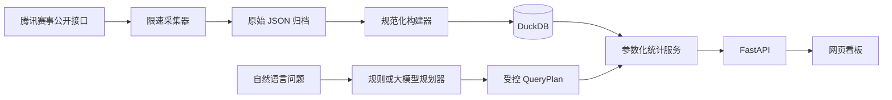

# KPL Data Lab

一个本地优先、可开源复现的王者荣耀 KPL 历史对局分析项目。它把公开赛事接口中的联赛、比赛、小局、BP、选手、英雄、装备和铭文数据归档到本地，再通过 DuckDB、FastAPI 和网页看板提供统计查询。

> 当前是可运行的 MVP。第一次启动会生成明确标记的演示数据；真实赛事数据需要主动执行回填命令。仓库不提交抓取后的比赛数据。

## 已实现

- 按近 N 天增量归档公开联赛、比赛、小局和局详情 JSON；支持断点跳过及强制刷新。
- 英雄选取率、禁用率、BP 率、胜率、KDA、月度趋势、分路和第几个 Pick 分布。
- 同位置对位英雄、同队搭档、结束时完整出装、铭文使用和双英雄组合统计。
- 选手胜率、KDA、MVP、英雄池和月度趋势。
- 自然语言查询：规则规划器开箱即用；也可接入兼容 Chat Completions JSON 输出的模型 API。
- 受控查询 DSL：模型只选择已经实现的统计动作，不能直接执行 SQL。
- 数据完整性审计、Python 测试、前端渲染测试和 Docker Compose。

## 架构



数据流的关键边界是：原始响应先落盘；统计只读规范化数据库；自然语言层不持有任意 SQL 权限。详细说明见 [数据源](docs/data-source.md)、[数据模型](docs/data-model.md)、[指标口径](docs/metrics.md) 和 [Agent 设计](docs/agent.md)。

## 本地启动

要求 Python 3.11+、Node.js 22.13+ 和 pnpm。

```bash
python3 -m venv .venv
source .venv/bin/activate
pip install -e '.[dev]'

kpl-analytics seed-demo
kpl-analytics audit
kpl-analytics serve
```

另开一个终端：

```bash
cd frontend
pnpm install
pnpm run dev
```

打开 `http://localhost:3000`；API 文档位于 `http://127.0.0.1:8000/docs`。

也可以使用 Docker：

```bash
docker compose up --build
```

## 回填近两年公开比赛

```bash
# 默认约每秒最多 5 个请求；请保持克制，不要高并发抓取。
kpl-analytics backfill --days 730
kpl-analytics build
kpl-analytics audit
```

原始响应保存在 `data/raw/`，数据库位于 `data/processed/kpl.duckdb`，二者均被 Git 忽略。若上游字段或接口发生变化，保留原始归档可以重新构建而不必再次请求网站。

## 可选的大模型配置

复制 `.env.example` 并填写：

```bash
export KPL_LLM_ENDPOINT="https://your-provider.example/v1/chat/completions"
export KPL_LLM_API_KEY="..."
export KPL_LLM_MODEL="your-json-capable-model"
```

未配置模型时，中文规则规划器仍支持英雄总览、对位、搭档、出装、铭文、选手和组合查询。模型失败时会自动回退到规则规划器。API Key 只放本地环境变量，不能提交到 Git。

## 主要 API

| 路径 | 功能 |
| --- | --- |
| `GET /api/meta` | 数据模式、覆盖日期和样本规模 |
| `GET /api/heroes` | 英雄列表与基础表现 |
| `GET /api/battles` | 按英雄、选手和日期筛选小局 |
| `GET /api/battles/{id}` | 单局 BP、双方、选手、装备和铭文详情 |
| `GET /api/heroes/{id}/overview` | 英雄 BP、胜率、趋势、位置和 Pick 顺位 |
| `GET /api/heroes/{id}/matchups` | 同位置对位统计 |
| `GET /api/heroes/{id}/teammates` | 队友英雄统计 |
| `GET /api/heroes/{id}/builds` | 完整出装统计 |
| `GET /api/heroes/{id}/runes` | 铭文统计 |
| `GET /api/combinations` | 双英雄组合 |
| `GET /api/players/{key}/overview` | 选手数据与英雄池 |
| `POST /api/query` | 自然语言查询 |

所有日期型接口支持 `start_date`、`end_date`，英雄接口另支持 `role`。

## 验证

```bash
ruff check .
pytest -q

cd frontend
pnpm run lint
pnpm test
```

## 合规边界

本项目仅供个人研究与技术学习，不隶属于腾讯或 KPL。上游公开接口并非承诺长期稳定的公共 API，路径和字段可能变化。请遵守目标网站的服务条款、robots/访问规则及适用法律，设置合理限速，不绕过登录、验证码、签名、反爬或访问控制，不分发批量抓取的数据和游戏素材。若上游明确要求停止访问，应停止采集。

## License

[MIT](LICENSE)
